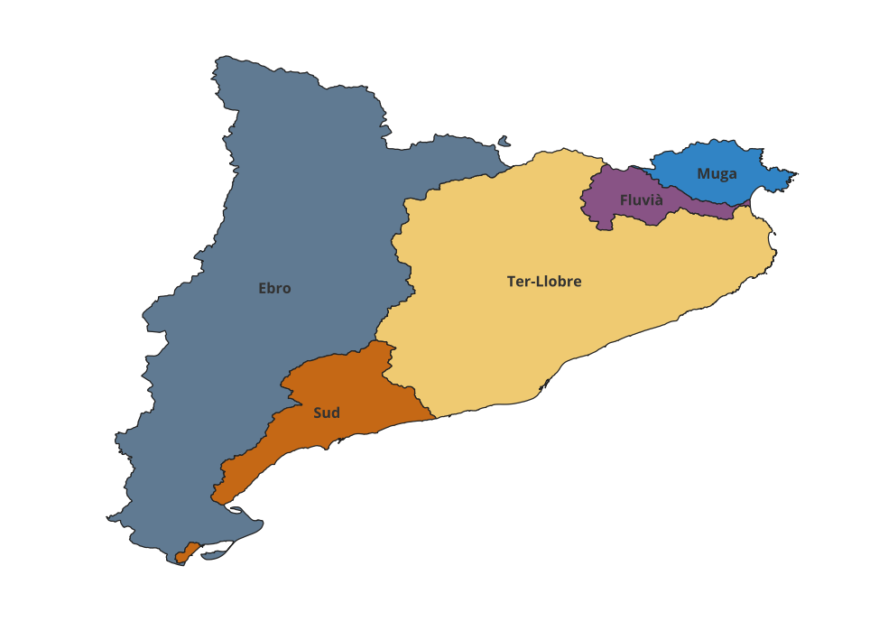

# Project background
As part of a research project, the objective was to assess the potential impacts of different water management scenarios in Catalonia, including drought scenarios. To support this analysis, sectoral and yearly (2021-2025) economic data needed to be collected and aggregated at the river basin level, as water management policies in Catalonia are geographically organized according to river basin categories.

This project estimates the number of Social Security affiliations (as a measure of employment) associated with each river basin system (sistemas de gestión de cuenca) in Catalonia.
The available Social Security data were not directly reported at the river-basin level. Instead, the analysis combines district (comarca) level data, municipal population data, and geographical boundaries to estimate the distribution of affiliations across river basin groups.
The analysis was performed in R, while QGIS was used to manage and visualize the resulting spatial data.



# Analytical question and problem
How can Social Security affiliations as a measure of employment be estimated at the river-basin level when the original data are available at a different geographical level?

The main challenge was that some districts were divided between multiple river basins. Therefore, affiliations for those districts could not simply be assigned to a single basin. Population data at the municipal level was used to estimate the share of each district area belonging to each basin group, assuming that the larger the population, the more economic activity exist in that area. 

# Project workflow
```text
        Social Security affiliation data
                    ↓
              Data cleaning
                    ↓
        Municipal population data
                    ↓
     Administrative district boundaries
                    ↓
          Spatial intersection
                    ↓
   Municipality → River basin system
                    ↓
     Territorial share calculation
                    ↓
       Population allocation
                    ↓
  Municipality → Comarca aggregation
                    ↓
     Population weights by system
                    ↓
  Allocation of affiliations by system
                    ↓
 Employment estimates by river basin system
             
         
```

# Data preparation
- Cleaned and standardized Social Security affiliation data.
- Harmonized geographical identifiers.
- Prepared municipal population data.
- Prepared geographical boundaries for municipalities and river basins.

# Overview of findings

The analysis identified 138 municipalities that are intersected by more than one river basin system, highlighting the importance of accounting for administrative and river-basin boundaries when aggregating economic data.

Rather than assigning these municipalities or their associated economic activity entirely to a single river basin, the analysis used their territorial distribution across systems to allocate population. Population was then aggregated to the comarca level and used to derive weights for distributing Social Security affiliations across river basin systems.

The final dataset provides Social Security affiliation estimates by river basin system, sector and year (2021–2025). This creates a consistent geographical dataset that can be used to assess the potential economic effects of different water-management and drought scenarios.


