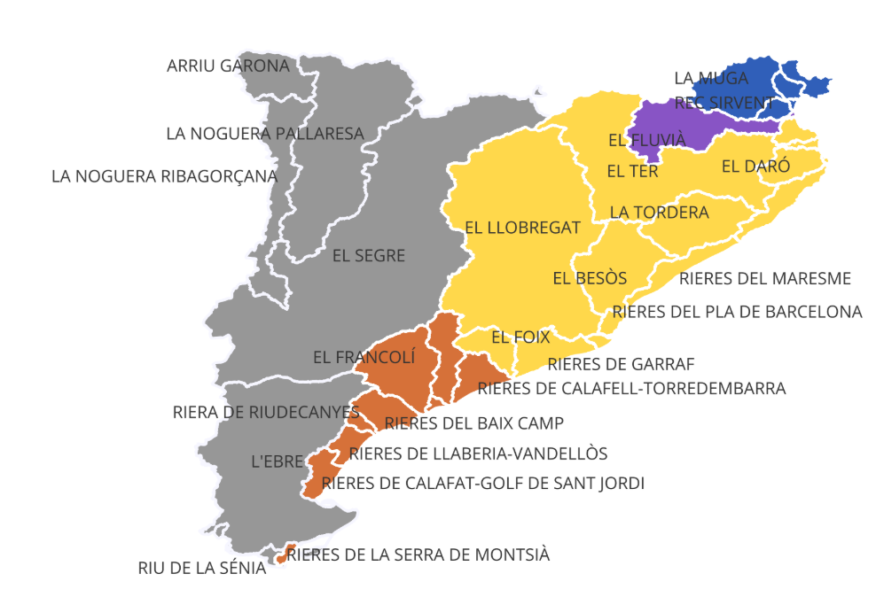

# Regional-Data-Integration-Economic-Analysis
 Integrate county-level economic and spatial data to estimate the distribution of economic activity across Catalonia's river basins.



# Project overview
This project estimates the number of Social Security affiliations (as a measure of employment) associated with each river basin (cuenca hidrográfica) in Catalonia.
The available Social Security data were not directly reported at the river-basin level. Instead, the analysis combines district (comarca) level data, municipal population data, and geographical boundaries to estimate the distribution of affiliations across river basins.
The analysis was performed in R, while QGIS was used to manage and visualize the resulting spatial data.

# Analytical question and problem
How can Social Security affiliations as a measure of employment be estimated at the river-basin level when the original data are available at a different geographical level?

Then explain the challenge:
The main challenge was that some districts were divided between multiple river basins. Therefore, affiliations could not simply be assigned to a single basin. Population data at the municipal level were used to estimate the share of each district area belonging to each basin.

# Project workflow
```text
Administrative affiliation data
              ↓
       Data cleaning
              ↓
Municipal population data
              ↓
Population-weighted allocation
              ↓
Administrative areas → River basins
              ↓
Affiliations allocated to basins
              ↓
         QGIS mapping
```

# Data preparation
- Cleaned and standardized Social Security affiliation data.
- Harmonized geographical identifiers.
- Prepared municipal population data.
- Prepared geographical boundaries for municipalities and river basins.


